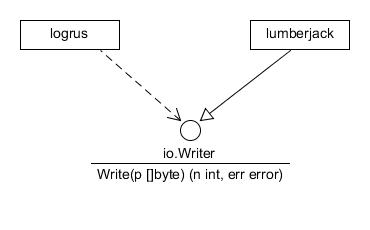

# Speedle - logging
## Overview
The following two open source projects are used to process log messages,
```
1. https://github.com/sirupsen/logrus
2. https://github.com/natefinch/lumberjack
```


Logrus is a structured logger for Go (golang), and completely API compatible with the golang standard library logger. Note that logrus doesn't support log rotation, and it is exactly the reason why we introduce the second project lumberjack, which provides a rolling logger. Logrus communicates with lumberjack using the io.Writer interface, please refer to the following diagram,



## Logging Configuration
There are two ways to configure logging for Speedle, either via command line arguments or via configuration file. 
### Configure logging via command line arguments
All the available command line arguments are listed below. The first two items are for logrus, and others are for lumberjack.
```
--log-level string
--log-formatter string
--log-reportcaller bool
--log-filename string
--log-maxsize int
--log-maxbackups int
--log-maxage int
--log-localtime bool
--log-compress bool
```

The detailed info of each item is in the following table. Note that any of the following configuration item is optional. If none of them is configured, then the log messages with info level or above will be written to the stderr in text format by default.

| Configuration Item | Description | Default Value |
|--------------------|-------------|---------------|
| --log-level        | log level, available levels are panic, fatal, error, warn, info and debug | info |
| --log-formatter    | log formatter, available values are text and json | text |
| --log-reportcaller | control whether get the caller info (file, line and function) included in the log entries | false |
| --log-filename     | log file name | no default value. If it isn't configured, then log messages are written to stderr |
| --log-maxsize      | maximum size in megabytes of the log file before it gets rotated. It's only valid when "--log-filename" is configured| 100 |
| --log-maxbackups   | maximum number of old log files to retain. It's only valid when "--log-filename" is configured | 0, which means to retain all old log files (though MaxAge may still cause them to get deleted) |
| --log-maxage       | maximum number of days to retain old log files. It's only valid when "--log-filename" is configured | 0, which means not to remove old log files based on age |
| --log-localtime    | control whether local time is used for formatting the timestamps in backup files. It's only valid when "--log-filename" is configured | false, which means to use UTC time |
| --log-compress     | control whether the rotated log files should be compressed. It's only valid when "--log-filename" is configured | false, which means not to perform compression |

The following two examples are in text and json format respectively, 
```
# text
time="2015-03-26T01:27:38-04:00" level=debug msg="Started observing beach" animal=walrus number=8
```
```
# json
{"animal":"walrus","level":"info","msg":"A group of walrus emerges from the
ocean","size":10,"time":"2014-03-10 19:57:38.562264131 -0400 EDT"}
```

### Configure logging via configuration file
An example is as below. Again, any configuration item is optional as well. 
```go
{
    "logConfig": {
        "level": "info",
        "formatter": "text", 
        "setReportCaller": "false",
        "rotationConfig": {
            "filename": "/mnt/logs/speedle.log",
            "maxSize": 20,
            "maxBackups": 5,
            "maxAge": 0,
            "LocalTime": false,
            "compress": false
        }
    }
}
```

## Best practices for configuring logging
If Speedle runs as docker containers, then it's more natural to to use the docker's json-file logging driver instead of the open source project natefinch/lumberjack to rotate log files, accordingly json-file logging driver is recommended for this case. Only sirupsen/logrus is needed, in other words, users don't need to configure anything for natefinch/lumberjack at all in this case. 

All docker related configuration items, including logging, are configured in /etc/docker/daemon.json. Please refer to [docker json-file](https://docs.docker.com/config/containers/logging/json-file/) to get more detailed info on how to configure json-file logging driver. The following snippet is an example, 
```
{
  "log-driver": "json-file",
  "log-opts": {
    "max-size": "20m",
    "max-file": "10"
  }
}
```

In most cases, users don't need to configure sirupsen/logrus either. The default log level is info, and the default log format is text. So generally users only need to configure the logging if they want to change the log level or log format, otherwise they need to configure nothing since the default configuration is good enough.

## How to add new log messages 
Firstly import the log package as below,
```go
import (
  log "github.com/sirupsen/logrus"
)
```
Secondly output any log messages anywhere you want. For example,
```go
  log.Debug("This is a debug log entry")
  log.Info("This is a info log entry")
  log.Warn("This is a warning log entry")
  log.Warning("This is a warning log entry again")
  log.Error("This is a error log entry")
```
Please refer to [speedle/logging/demo/demo.go](https://gitlab-odx.oracledx.com/wcai/speedle/blob/master/logging/demo/demo.go) to get more detailed info.

## Integration with 3rd-party log collectors
Speedle logs can be easily integrated with 3rd-party log collectors, such as fluentd or filebeat. What the users need to do is to configure fluentd or filebeat to monitor the log files generated by Speedle. The following configuration snippet is an example of using fluentd's in_tail input plugin to collect docker containers' log, including Speedle's log of course if Speedle runs as containers. 
```
    <source>
      @type tail
      path /var/lib/docker/containers/*/*.log
      pos_file /data/fluentd/fluentd.log.pos
      tag speedle.log
      <parse>
        @type json
        time_key time
        keep_time_key true
      </parse>
      refresh_interval 5
    </source>
```
Please refer to [fluentd](https://www.fluentd.org/) and [filebeat](https://www.elastic.co/products/beats/filebeat) official websites to get more detailed info.

